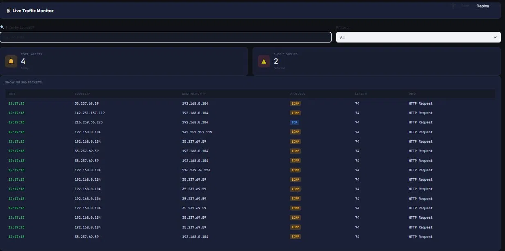
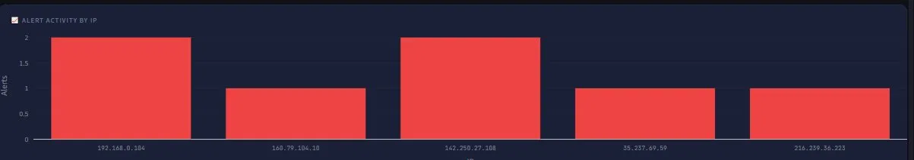
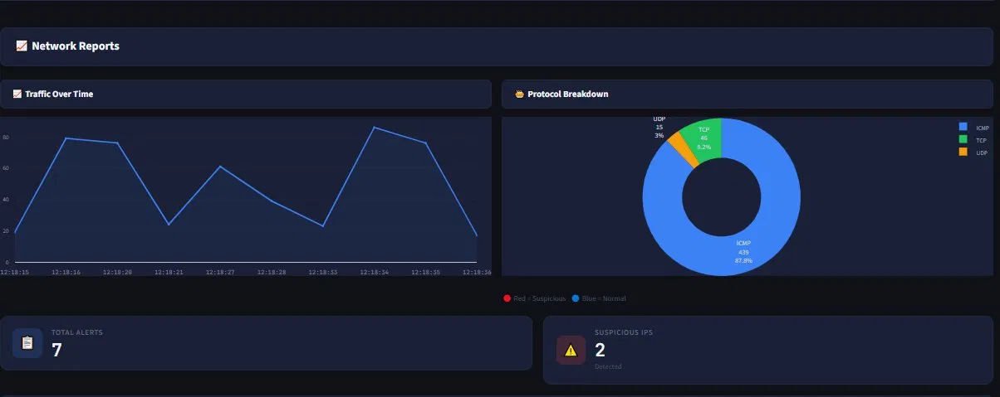
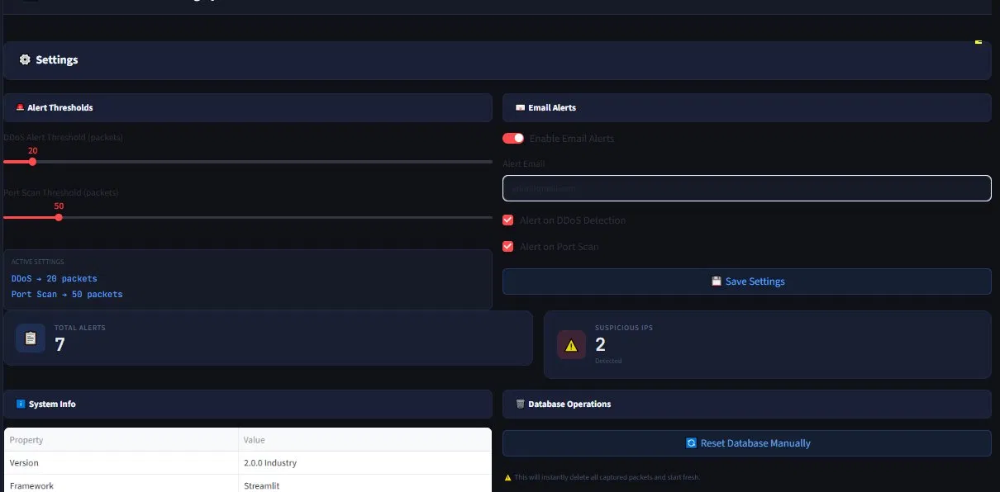
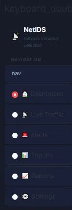

<div align="center">

# 🛡️ Smart Network Monitoring System

### *NetIDS — Network Intrusion Detection System*

**A professional Python-based platform for real-time network traffic monitoring, anomaly detection, and security alerting.**


</div>

---

## 📸 Live Demo — Dashboard Preview

<div align="center">

### 🏠 Main Dashboard

*Real-time stats: Total Packets, Packet/Sec rate, Alerts, Suspicious IPs — with live traffic graph and protocol distribution*

---

### 📡 Live Traffic Monitor

*Filter packets by Source IP or Protocol — live packet table with timestamps, source/destination IPs, protocol tags*

---

### 🚨 Security Alerts

*DDoS Alerts & Port Scan detections — categorized, color-coded, with suspicious IP tracking*

---

### 🏆 Top Source IPs

*Ranked IP list with suspicious flags — red = suspicious, blue = normal — with packet distribution chart*

---

### 📈 Network Reports

*Traffic Over Time graph + Protocol Breakdown donut chart (ICMP/TCP/UDP) + total alert summary*

---

### 📋 Summary Report

*Complete session stats: Total Packets, Unique Sources/Destinations, DDoS & Port Scan counts, Most Active IP — CSV export available*

---

### ⚙️ Settings Panel

*Configure DDoS & Port Scan thresholds, enable email alerts, system info, and database management*

---

### 🗂️ Navigation Sidebar

*Clean dark sidebar: Dashboard → Live Traffic → Alerts → Top IPs → Reports → Settings*

</div>

---

## 📌 Overview

**Smart Network Monitoring System (NetIDS)** is a professional-grade network intrusion detection platform built entirely in Python. It captures live network packets, analyzes traffic patterns, detects threats like DDoS attacks and port scans in real-time, and sends instant email alerts — all through a sleek dark-themed Streamlit dashboard.

> Built as part of an academic project at **UET Lahore — BS Data Science (2025 Cohort)**

---

## ⚡ Features

| # | Feature | Description |
|---|---------|-------------|
| 1 | 📡 **Real-time Packet Sniffing** | Captures live network packets using Scapy |
| 2 | 🧠 **DDoS Detection** | Detects high-volume packet flooding from suspicious IPs |
| 3 | 🔍 **Port Scan Detection** | Identifies port scanning attempts in real-time |
| 4 | 📊 **Interactive Dashboard** | Dark-themed Streamlit UI with Plotly live charts |
| 5 | 📧 **Email Alert System** | Instant Gmail SMTP alerts on threat detection |
| 6 | 🏆 **Top IPs Ranking** | Ranked suspicious IP list with packet counts |
| 7 | 📈 **Protocol Analysis** | ICMP / TCP / UDP breakdown with donut charts |
| 8 | 🗄️ **SQLite Logging** | All packets and alerts stored in local database |
| 9 | 📋 **Summary Reports** | Full session stats with CSV export |
| 10 | ⚙️ **Configurable Thresholds** | Adjustable DDoS & Port Scan sensitivity sliders |

---

## 🛠️ Tech Stack

| Category | Technology |
|----------|-----------|
| 🐍 Language | Python 3.8+ |
| 📡 Packet Capture | Scapy |
| 🖥️ Dashboard | Streamlit |
| 📊 Visualization | Plotly |
| 🐼 Data Analysis | Pandas |
| 🗄️ Database | SQLite |
| 📧 Email Alerts | SMTP (Gmail) |
| 🔧 Framework Version | 2.0.0 Industry |

---

## 📂 Project Structure

```
Smart-Network-Monitoring-System/
│
├── main.py              # Entry point — starts monitoring system
├── sniffer.py           # Live packet capture using Scapy
├── Rules.py             # DDoS & Port Scan detection rules
├── email_alerts.py      # Gmail SMTP alert configuration
├── Dashboard_UI.py      # Full Streamlit dashboard (NetIDS)
├── screenshots/         # Dashboard preview images
│   ├── dashboard.png.webp
│   ├── live traffic.png.webp
│   ├── securityalerts.png.webp
│   ├── top ips.png.webp
│   ├── reports.png.webp
│   ├── summary reports.png.webp
│   ├── settings.png.webp
│   └── sidebar.png.webp
├── README.md
└── .gitignore
```

---

## ▶️ How to Run

### 1️⃣ Clone the repository
```bash
git clone https://github.com/hsybmalik96/Smart-Network-Monitoring-System.git
cd Smart-Network-Monitoring-System
```

### 2️⃣ Install dependencies
```bash
pip install scapy streamlit pandas plotly
```

### 3️⃣ Configure email alerts
Open `email_alerts.py` and update:
```python
SENDER_EMAIL    = "your_email@gmail.com"
SENDER_PASSWORD = "your_app_password"    # Gmail App Password
RECEIVER_EMAIL  = "receiver@gmail.com"
```

> 💡 **Gmail App Password:** Google Account → Security → 2-Step Verification → App Passwords

### 4️⃣ Launch the dashboard
```bash
streamlit run Dashboard_UI.py
```

### 5️⃣ Start packet sniffing (new terminal)
```bash
python main.py
```

---

## ⚠️ Important Notes

- ⚡ **Admin/Root privileges required** for packet sniffing
  - Windows → Run CMD as **Administrator**
  - Linux/Mac → `sudo python main.py`
- 🔐 **Never commit email credentials** — use `.env` files in production
- ☁️ **Streamlit Cloud** doesn't support root-level packet capture — run locally

---

## 🔮 Future Enhancements

- [ ] 🤖 ML-based anomaly detection
- [ ] 🗺️ Live IP geolocation threat map
- [ ] 🌐 Multi-interface packet capture
- [ ] 🔔 Telegram / Slack push notifications
- [ ] 📄 Auto-generated PDF security reports
- [ ] 🐳 Docker containerization

---

## 📬 Contact

- 📱 **WhatsApp:** [Click to Chat](https://wa.me/923400223450)
- 💼 **LinkedIn:** [linkedin.com/in/yourusername](www.linkedin.com/in/haseeb-shahid-ba47913a8)

---

## ⭐ Support

If this project helped you, please give it a **⭐ star** on GitHub!

---

## 📜 License

This project is licensed under the **MIT License** — see [LICENSE](LICENSE) for details.

---

<div align="center">

Made with ❤️ by **Haseeb Shahid** | UET Lahore — BS Data Science 2025

*"Security is not a product, but a process." — Bruce Schneier*

</div>
